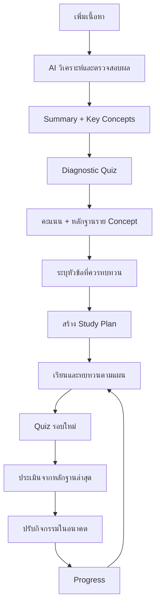

# PRD: LeanPilot PWA

เวอร์ชัน: 1.0 — ร่างสำหรับกำหนดขอบเขตและพัฒนา MVP  
วันที่: 30 กันยายน 2026  
สถานะ: ข้อเสนอผลิตภัณฑ์ ยังไม่ได้ยืนยันด้วยการทดลองกับผู้ใช้

> ใช้ชื่อ LeanPilot ตามคำขอ โดยชื่อแพ็กเกจใน repository ปัจจุบันคือ `learnpilot` ควรยืนยันชื่อแบรนด์ก่อนเผยแพร่

## 1. ภาพรวมผลิตภัณฑ์

LeanPilot คือแอปเรียนรู้แบบ PWA ที่เปลี่ยนเนื้อหาของผู้ใช้ให้เป็นวงจรการเรียนรู้เฉพาะบุคคล: สรุปเนื้อหา → ทดสอบความเข้าใจ → ระบุจุดที่ต้องทบทวน → วางแผนเรียน → ทดสอบใหม่ → ปรับแผนตามหลักฐานล่าสุด

คุณค่าหลัก: **รู้ว่าควรเรียนอะไรต่อ เพราะอะไร และเห็นว่าความเข้าใจเปลี่ยนไปอย่างไร**

AI ช่วยจัดโครงสร้างเนื้อหาและสร้างคำถาม ส่วนการให้คะแนน การจัดลำดับแผน และการบันทึกความก้าวหน้าใช้กติกาที่ตรวจสอบได้ ผู้ใช้แก้เป้าหมาย เวลาเรียน และวันเรียนได้เสมอ

## 2. ปัญหาและผู้ใช้เป้าหมาย

### ปัญหาที่ต้องแก้

- มีเอกสารจำนวนมาก แต่ไม่รู้ว่าจะเริ่มอ่านส่วนใด
- อ่านสรุปแล้วรู้สึกเข้าใจ แต่ยังไม่เคยตรวจสอบด้วยการตอบคำถาม
- รู้คะแนนรวม แต่ไม่รู้ว่าแนวคิดใดเป็นจุดอ่อน
- ตารางเรียนคงที่ ไม่ปรับตามผลทดสอบหรือวันที่เรียนไม่ทัน
- จำนวนวันที่ใช้งานเพิ่มขึ้น แต่ยังไม่เห็นหลักฐานว่าความเข้าใจดีขึ้น

### กลุ่มเป้าหมายเริ่มต้น

นักศึกษาและผู้เรียนด้วยตนเองที่มีเอกสารภาษาไทยหรืออังกฤษ ต้องการเตรียมสอบหรือทำความเข้าใจเนื้อหา และมีเวลาประมาณ 15–60 นาทีต่อวัน

### Jobs to be done

“เมื่อฉันมีเอกสารที่ต้องเรียน ฉันอยากรู้หัวข้อสำคัญและจุดที่ยังตอบไม่ได้ เพื่อใช้เวลาทบทวนกับเรื่องที่จำเป็นและพร้อมสำหรับการทดสอบครั้งถัดไป”

## 3. เป้าหมายและตัวชี้วัด

ตัวเลขต่อไปนี้เป็นเป้าหมายตั้งต้นสำหรับ pilot ไม่ใช่ผลลัพธ์ที่พิสูจน์แล้ว

| เป้าหมาย | ตัวชี้วัด | เป้าหมายตั้งต้น |
|---|---|---|
| ผู้ใช้เข้าสู่วงจรเรียนรู้ได้จริง | ผู้ใช้ใหม่ที่เพิ่มเนื้อหาและส่ง diagnostic quiz ภายใน 24 ชั่วโมง / ผู้ใช้ใหม่ที่เริ่มเพิ่มเนื้อหา | ≥ 50% |
| ผู้ใช้ทำวงจรเรียนรู้ต่อเนื่อง | ผู้ใช้ที่ส่ง quiz รอบใหม่หลังทำกิจกรรมตามแผน / ผู้ใช้ที่ได้รับแผนแรก ภายใน 7 วัน | ≥ 35% |
| ผู้ใช้กลับมาเรียน | ผู้ใช้ที่ทำกิจกรรมการเรียนในวันที่ 7 / ผู้ใช้ที่ activate | ≥ 25% |
| ความเข้าใจมีแนวโน้มดีขึ้น | การเปลี่ยนแปลงคะแนนใน concept เดิมจากคำถามใหม่ระดับใกล้เคียงกัน | รายงานค่ามัธยฐานและจำนวนตัวอย่างก่อนตั้งเป้าหมาย |
| ผลลัพธ์ AI ใช้งานได้ | งานสร้าง summary และ quiz ที่ผ่าน validation / งานทั้งหมด | ≥ 95% |

North Star: จำนวนวงจร **เรียนตามแผน → ส่ง quiz → ได้แผนปรับใหม่** ที่สำเร็จต่อผู้ใช้รายสัปดาห์

ห้ามใช้คะแนนต่างชุดที่ความยากต่างกันสรุปว่าผู้ใช้เก่งขึ้นโดยตรง และห้ามนับการเปิดหน้าเป็นหลักฐานว่าผู้ใช้เข้าใจ

## 4. ขอบเขต MVP

### Must have

1. บัญชีผู้ใช้และพื้นที่เนื้อหาส่วนตัว
2. เพิ่มเนื้อหาด้วยข้อความและ PDF ที่มี text layer
3. Summary และ Key Concepts พร้อมตำแหน่งอ้างอิงในต้นฉบับ
4. Diagnostic quiz แบบปรนัย พร้อมเฉลยและคำอธิบายหลังส่ง
5. คะแนนรวมและผลแยกตาม concept
6. วิเคราะห์จุดที่ควรทบทวนพร้อมระดับความเพียงพอของข้อมูล
7. Study Plan ตามเวลาว่างและเป้าหมายของผู้ใช้
8. ทำกิจกรรมเรียน ทบทวน และ quiz รอบใหม่
9. ปรับกิจกรรมในอนาคตอัตโนมัติ พร้อมประวัติและเหตุผล
10. Dashboard แสดงความก้าวหน้าและสิ่งที่ควรทำวันนี้
11. PWA ติดตั้งได้บนสภาพแวดล้อมที่รองรับ พร้อมอ่านเนื้อหาที่ดาวน์โหลดไว้แบบ offline
12. ลบเนื้อหาและข้อมูลที่เกี่ยวข้องได้

### หลัง MVP

- OCR สำหรับเอกสารสแกน รูปภาพ เสียง วิดีโอ และนำเข้า URL
- คำถามอัตนัยและการประเมินคำตอบด้วย AI
- Flashcards, spaced repetition ที่ปรับจากข้อมูลระยะยาว
- Push notification, calendar integration และการแชร์กับครู
- ระบบชำระเงิน ทีม ห้องเรียน และเนื้อหาสาธารณะ

MVP ไม่รวม AI tutor แบบสนทนาเต็มรูปแบบ ไม่รับประกันผลสอบ และไม่อ้างว่าเป็นการประเมินมาตรฐานทางการศึกษา

## 5. User Journey

### เส้นทางหลัก

1. ผู้ใช้สร้างวิชา ตั้งเป้าหมาย วันสอบถ้ามี และเวลาว่างรายวัน
2. เพิ่มเอกสาร ระบบแสดงสถานะรับไฟล์ แยกข้อความ และวิเคราะห์
3. ผู้ใช้อ่านสรุป เปิดต้นฉบับจากอ้างอิง และเริ่มแบบทดสอบ
4. ส่งคำตอบ ระบบแสดงคะแนน คำอธิบาย และ concept ที่ต้องทบทวน
5. ระบบสร้างแผน โดยแสดงเวลาที่คาดว่าจะใช้และเหตุผลของกิจกรรม
6. ผู้ใช้ทำกิจกรรมและบันทึกเสร็จ ข้าม หรือเลื่อน
7. Quiz รอบใหม่ใช้คำถามที่แตกต่างและวัด concept ที่เกี่ยวข้อง
8. ระบบปรับแผนส่วนที่ยังไม่เริ่ม พร้อมแจ้งว่าปรับอะไรและเพราะอะไร

### เส้นทางเมื่อเกิดปัญหา

- PDF ไม่มีข้อความ: แจ้งว่า MVP ยังไม่รองรับเอกสารสแกน และเสนอให้วางข้อความแทน
- เนื้อหาน้อยเกินไป: ขอเพิ่มเนื้อหา ไม่สร้างคำถามโดยเดาความรู้ที่ไม่มีในต้นฉบับ
- AI ล้มเหลว: คงไฟล์ต้นฉบับ ให้ลองใหม่โดยไม่สร้างงานซ้ำ
- เวลาไม่พอก่อนวันสอบ: แสดงปริมาณงานที่เกินและจัดลำดับหัวข้อ ผู้ใช้เปลี่ยนเป้าหมายหรือเวลาได้
- Offline: อ่านข้อมูลที่บันทึกไว้และบันทึกกิจกรรมรอ sync; การสร้าง AI และส่ง quiz ต้อง online ใน MVP

## 6. หน้าจอหลัก

| หน้าจอ | สิ่งที่ผู้ใช้ต้องทำได้ |
|---|---|
| Onboarding | ตั้งเป้าหมาย ภาษา timezone และเวลาว่าง |
| Home / Today | เห็นกิจกรรมวันนี้ เวลาโดยประมาณ และปุ่มเริ่มเรียน |
| Library | สร้างวิชา เพิ่มไฟล์ ดูสถานะ ลบเนื้อหา |
| Content Detail | อ่าน summary, concepts และเปิดหลักฐานต้นฉบับ |
| Quiz | ตอบ บันทึกคำตอบ กลับมาเล่นต่อก่อนส่ง |
| Quiz Result | ดูคะแนน เฉลย เหตุผล และหัวข้อที่ควรทบทวน |
| Study Plan | ดูแผนรายวัน เลื่อนกิจกรรม เปลี่ยนเวลา และดูเหตุผลการปรับ |
| Study Session | อ่านเนื้อหาที่เกี่ยวข้องและบันทึกผลกิจกรรม |
| Progress | ดูหลักฐานราย concept ประวัติ quiz และกิจกรรมที่ทำสำเร็จ |
| Settings | จัดการบัญชี เวลาเรียน ข้อมูล offline และคำขอลบข้อมูล |

Navigation บนมือถือ: Today, Library, Plan, Progress; Settings อยู่ในเมนูบัญชี

## 7. Functional Requirements และ Acceptance Criteria

| ID | Requirement | Acceptance criteria |
|---|---|---|
| FR-01 | บัญชีและสิทธิ์ | ผู้ใช้เข้าถึงได้เฉพาะวิชา ไฟล์ และผลเรียนของตนเองทั้งผ่าน UI และ API |
| FR-02 | นำเข้าเนื้อหา | รองรับข้อความและ PDF text layer; ข้อเสนอ limit เริ่มต้น 20 MB และข้อความที่แยกได้ 100,000 ตัวอักษรต่อรายการ; เกิน limit ต้องแจ้งก่อนเริ่ม AI |
| FR-03 | งานวิเคราะห์ | สถานะ queued, extracting, analyzing, ready, failed; refresh หน้าแล้วงานยังอยู่; retry ไม่สร้างรายการซ้ำ |
| FR-04 | Summary | มีภาพรวม ประเด็นหลัก และ references ที่เปิดได้; ผลที่อ้างอิงต้นฉบับไม่ได้ต้องไม่เผยแพร่เป็น ready |
| FR-05 | Concepts | แต่ละ concept มี ID ชื่อ คำอธิบาย และ references; ใช้ ID เดิมใน quiz ผลเรียน และแผน |
| FR-06 | สร้าง quiz | ชุดแรกตั้งต้น 10 ข้อ ลดจำนวนเมื่อเนื้อหาไม่พอ; ทุกข้อมี 4 ตัวเลือก คำตอบถูกหนึ่งข้อ คำอธิบาย concept ID และ reference ที่ผ่าน validation |
| FR-07 | ทำ quiz | เก็บคำตอบ draft ข้ามหน้าได้; ส่งซ้ำต้องได้ attempt เดิม; เฉลยไม่ถูกส่งไป client ก่อนส่ง quiz |
| FR-08 | คะแนน | ให้คะแนนฝั่ง server ตาม answer key; ต้องตอบครบก่อนส่ง; ตอบถูกได้ 1 คะแนน ผิดได้ 0; แสดงคะแนนเต็มและจำนวนข้อ |
| FR-09 | จุดอ่อน | แสดงผลราย concept พร้อมจำนวนข้อที่ใช้ประเมิน; ข้อมูลไม่พอแสดงว่า “ยังประเมินไม่เพียงพอ” |
| FR-10 | แผนแรก | ใช้คะแนน concept เวลาว่าง วันเป้าหมาย และ duration ของกิจกรรม; รวมเวลาในแต่ละวันไม่เกินเวลาว่างที่ตั้งไว้ |
| FR-11 | กิจกรรม | บันทึก pending, in_progress, completed, skipped และเลื่อนวันได้; การทำกิจกรรมเสร็จไม่เพิ่มคะแนนความเข้าใจโดยตรง |
| FR-12 | Quiz รอบใหม่ | เน้น concept ที่ทบทวนและมีบางข้อจาก concept ก่อนหน้า; หลีกเลี่ยงคำถามซ้ำตรงตัว; ถ้าคำถามใหม่ไม่พอให้แจ้งข้อจำกัด |
| FR-13 | ปรับแผน | หลังส่ง quiz สำเร็จ ปรับเฉพาะกิจกรรมที่ยังไม่เริ่ม; กิจกรรมที่ผู้ใช้ล็อกไว้คงอยู่; มี version และเหตุผล; ย้อนกลับได้ก่อนเริ่มกิจกรรมใหม่ |
| FR-14 | Progress | แสดงคะแนนแต่ละ attempt และหลักฐาน concept; แยกความสำเร็จของกิจกรรมออกจากผลทดสอบ |
| FR-15 | PWA / Offline | เมื่อบันทึกเนื้อหาไว้ ผู้ใช้เปิด summary และแผนล่าสุดได้ offline; แสดงสถานะข้อมูลและ pending sync; logout ล้างข้อมูลส่วนตัวที่ cache ไว้ |
| FR-16 | ลบข้อมูล | ลบเนื้อหาแล้วไม่ปรากฏใน UI และไม่ถูกใช้สร้าง quiz/แผนใหม่; ลบไฟล์และข้อมูลอนุพันธ์ตามกระบวนการที่ติดตามได้ |

## 8. กติกาการประเมินและปรับแผน

### การประเมินราย concept

- หนึ่งคำถามมี primary concept หนึ่งรายการ เพื่อให้คำนวณผลชัดเจน
- ใช้คำตอบจากคำถามไม่ซ้ำใน 3 attempts ล่าสุดที่อ้างอิง content version เดียวกัน
- หลักฐานน้อยกว่า 3 ข้อ: สถานะ “ข้อมูลไม่พอ” พร้อมสร้างกิจกรรมประเมินเพิ่มเติม
- เมื่อมีอย่างน้อย 3 ข้อ: ต่ำกว่า 60% = ควรทบทวน, 60–79% = กำลังพัฒนา, ตั้งแต่ 80% = ทำได้ดีในชุดคำถามนี้
- สถานะ “ทำได้ดี” ไม่หมายถึงจำได้ระยะยาว ควรมีการทดสอบภายหลัง
- เกณฑ์เหล่านี้เป็น heuristic ของ MVP ต้องประเมินความเหมาะสมจาก pilot

### การจัดลำดับกิจกรรม

1. Concept ที่ควรทบทวนและเป็นพื้นฐานของหัวข้ออื่น
2. Concept ที่ควรทบทวนรายการอื่น
3. Concept ที่ข้อมูลยังไม่พอ
4. Concept ที่กำลังพัฒนา
5. ทบทวน concept ที่ทำได้ดีเมื่อมีเวลาที่เหลือ

AI อาจเสนอความสัมพันธ์ prerequisite แต่ต้องอ้างอิงเนื้อหาได้ หากไม่ชัดเจนใช้ลำดับหัวข้อในเอกสาร

### การสร้างและปรับแผน

- แบ่งกิจกรรมอ่าน ทบทวน และ quiz เป็นช่วง 10–25 นาที; duration เป็นค่าประมาณที่ปรับได้
- ใช้เวลาท้องถิ่นและ timezone ที่ผู้ใช้ตั้งไว้ในการกำหนดวัน
- หากไม่มีวันสอบ เสนอแผนเริ่มต้น 7 วัน
- หากกิจกรรมเกินความจุ ให้คงรายการที่ยังจัดไม่ได้และบอกเหตุผล ห้ามจัดแผนที่เกินเวลาอย่างเงียบ ๆ
- วันที่พลาดเรียน: ย้ายงานที่ยังไม่เริ่มไปช่องเวลาถัดไปตามลำดับความสำคัญ ไม่เพิ่มภาระวันถัดไปเกินขีดจำกัด
- การส่ง quiz หรือเปลี่ยนเวลาว่างเป็น trigger ของการปรับแผน
- ทุก version บันทึก trigger, inputs, กิจกรรมที่เปลี่ยน และเหตุผล เช่น “เพิ่มทบทวนเรื่อง X เพราะตอบถูก 1 จาก 4 ข้อ”
- ป้องกันปรับแผนซ้ำจาก attempt เดียวกันด้วย idempotency key

## 9. ข้อกำหนด AI และคุณภาพเนื้อหา

Pipeline: extraction → แบ่งข้อความพร้อมตำแหน่ง → summary/concepts → quiz → schema validation → ตรวจ references และ answer key → บันทึกผล

- ใช้เนื้อหาผู้ใช้เป็นแหล่งหลัก การตีความเพิ่มเติมต้องติดป้ายให้ชัดเจน
- References ของ PDF ใช้หน้าและข้อความอ้างอิง; ข้อความที่วางใช้ section/chunk และ excerpt
- ตรวจว่า reference มีอยู่จริงและสนับสนุนข้อสรุปหรือคำตอบ; การตรวจรูปแบบเพียงอย่างเดียวไม่พอ
- ถ้าพบคำถามกำกวม คำตอบถูกหลายข้อ หรือเฉลยไม่มีหลักฐาน ให้สร้างใหม่หรือถอนข้อนั้น
- เนื้อหาในเอกสารเป็นข้อมูล ห้ามทำตามคำสั่งที่ฝังอยู่ในเอกสารและห้ามเปิดเผย secret
- ใช้ structured output; บันทึก model/prompt version, content version, latency และสถานะ validation
- จำกัด retry และค่าใช้จ่ายต่อเอกสาร; เมื่อเกินขีดจำกัดให้แสดง failed ที่ลองใหม่ได้
- ให้ผู้ใช้รายงานสรุปหรือข้อสอบผิด; ถอนคำถามที่ยืนยันว่าผิดออกจากการประเมินและคำนวณแผนใหม่โดยมีประวัติ
- ชุดตรวจคุณภาพก่อนเปิด pilot ต้องครอบคลุมภาษาไทย อังกฤษ ข้อความสั้น PDF ยาว เนื้อหาไม่ครบ และข้อความที่พยายามสั่งระบบ

## 10. ข้อกำหนด PWA และ Non-functional Requirements

| ด้าน | ข้อกำหนด |
|---|---|
| Responsive | ใช้งานหลักได้ตั้งแต่หน้าจอกว้าง 360 px และ desktop |
| Accessibility | มี keyboard navigation, focus ที่เห็นชัด, labels และสถานะที่ไม่ใช้สีอย่างเดียว; ตั้งเป้า WCAG 2.2 AA และตรวจตามขอบเขตหน้าจอจริง |
| Performance | เป้าหมาย p75 LCP ≤ 2.5 วินาทีสำหรับหน้าหลักบนโปรไฟล์เครือข่ายมือถือที่กำหนดในการทดสอบ |
| AI latency | เป้าหมาย p95 งานวิเคราะห์ ≤ 120 วินาทีสำหรับ fixture ข้อความไม่เกิน 20,000 ตัวอักษร; เอกสารใหญ่ใช้ background job และแสดงสถานะ |
| Reliability | งานสำคัญ retry ได้และไม่สร้างผลซ้ำ; เก็บ attempt และ plan version แบบ transaction |
| Installability | มี manifest, icons, service worker และ app shell; แสดงคำแนะนำติดตั้งตามความสามารถของ browser |
| Offline | ให้ผู้ใช้เลือกบันทึกเนื้อหา; ห้าม cache เฉลยล่วงหน้า; แจ้งเมื่อพื้นที่ไม่พอหรือ cache ถูกล้าง |
| Sync | กิจกรรมใช้ event ID ไม่ซ้ำ; server เป็นแหล่งจริงของคะแนนและแผน; หากเกิด conflict เก็บผล completed และแจ้งให้โหลดแผนล่าสุด |
| Update | แจ้ง app update เมื่อพร้อม โดยไม่ทิ้ง quiz draft ที่กำลังทำ |
| Security | ตรวจสิทธิ์ฝั่ง server, ตรวจไฟล์, จำกัดอัตราการเรียก; API key สำหรับ AI อยู่ฝั่ง server |
| Privacy | อธิบายว่าข้อมูลใดส่งไปประมวลผล AI; กำหนด retention และการลบตามผู้ให้บริการที่เลือกก่อน production |

ข้อกำหนดรองรับ browser ต้องตรวจบนอุปกรณ์จริงก่อน release โดยเฉพาะการติดตั้งและ offline บน iOS/Android ไม่ควรถือว่าทุก browser มีพฤติกรรมเหมือนกัน

## 11. แบบจำลองข้อมูลขั้นต่ำ

| Entity | ข้อมูลหลัก |
|---|---|
| User / Preferences | user_id, timezone, language, daily availability |
| Course | owner_id, title, goal, target_date |
| Content / ContentVersion | course_id, source_type, file_path, extracted_text, version, status |
| SourceChunk | content_version_id, chunk_id, page/section, text |
| AnalysisJob | content_version_id, stage, retry_count, error, model/prompt version |
| Summary / Concept | content_version_id, output, references; concept_id และชื่อ |
| Question | concept_id, content_version_id, choices, difficulty, validation_status; answer key เก็บฝั่ง server |
| Quiz / Attempt / Response | quiz_id, user_id, draft/submitted, question_ids, answers, scores, timestamps |
| ConceptEvidence | user_id, concept_id, attempt_id, correct_count, sample_count |
| StudyPlan / PlanVersion | user_id, course_id, inputs, trigger, reason, version |
| StudyTask / ActivityEvent | plan_version_id, concept_id, date, estimated_minutes, status, locked, event_id |
| ContentIssue | user_id, entity_id, issue_type, review_status |

ทุกข้อมูลส่วนตัวต้องตรวจ ownership; การแก้เนื้อหาสร้าง content version ใหม่และแจ้งว่าผลเดิมเป็นของเวอร์ชันก่อนหน้า

## 12. โครงสร้างระบบที่เสนอ

Repository ปัจจุบันมี React, TypeScript, Vite, Tailwind และ Supabase client ใน package.json ข้อเสนอต่อไปนี้เป็นโครงสร้างเป้าหมาย ไม่ใช่การยืนยันว่ามีระบบเหล่านี้แล้ว

- Frontend: React PWA สำหรับ UI, quiz draft และ offline cache
- Backend: API สำหรับตรวจสิทธิ์ สร้างงาน ให้คะแนน และปรับแผน
- Storage: ไฟล์ต้นฉบับและข้อมูลการเรียน โดยบังคับสิทธิ์ตามเจ้าของ
- Worker: extraction และ AI jobs พร้อม queue/retry
- AI provider: เรียกผ่าน backend adapter เพื่อเปลี่ยนผู้ให้บริการได้
- Scheduler: กติกาจัดเวลาและลำดับกิจกรรมที่ทดสอบได้ โดย AI ช่วยเขียนคำอธิบาย

หากใช้ Supabase ต่อ ให้กำหนด Auth, database, Storage และ Row Level Security ก่อนใช้ข้อมูลจริง เลือกวิธีรัน worker จากเวลาประมวลผลและข้อจำกัดของ environment ที่จะ deploy

## 13. Analytics

Events: `content_import_started`, `content_ready`, `analysis_failed`, `summary_viewed`, `quiz_started`, `quiz_submitted`, `plan_created`, `study_task_completed`, `plan_adjusted`, `learning_cycle_completed`, `content_issue_reported`

Properties ที่จำเป็น: pseudonymous user ID, course ID, content version, attempt ID, plan version, duration, outcome และ error category ห้ามส่งข้อความเอกสาร คำตอบแบบ free text หรือข้อมูลระบุตัวบุคคลไป analytics โดยไม่จำเป็น

กำหนด `learning_cycle_completed` เมื่อมี completed study task ที่เกี่ยวข้อง ตามด้วย submitted quiz และ plan version ใหม่จาก attempt นั้น นับได้ครั้งเดียวต่อ attempt

## 14. แผนพัฒนาและ Release Gates

| ระยะ | Deliverable | เกณฑ์ผ่าน |
|---|---|---|
| 1: Foundation | บัญชี Library และ import jobs | สิทธิ์ข้อมูลถูกต้อง; import/retry/error ใช้งานได้ |
| 2: Understanding | Summary, concepts และ references | ตรวจเนื้อหาตัวอย่างทั้งสองภาษาและเปิดหลักฐานได้ |
| 3: Assessment | Quiz, grading และผลราย concept | เฉลยไม่รั่วก่อนส่ง; คะแนนคำนวณถูก; ส่งซ้ำไม่ซ้ำ |
| 4: Adaptive learning | Plan, study tasks, quiz รอบใหม่ | ทำวงจรครบได้; ไม่เกินเวลา; ปรับแผนมีเหตุผลและย้อนกลับได้ |
| 5: PWA + Pilot | Offline, progress และ analytics | ตรวจบนมือถือจริง; sync ไม่ทำข้อมูลซ้ำ; metrics เก็บครบ |

ไม่กำหนดวันส่งมอบจนกว่าจะทราบทีม งบ AI และความพร้อมของ backend

### สถานการณ์ทดสอบสำคัญก่อน pilot

- ผู้ใช้สองคนไม่สามารถอ่านหรือเปลี่ยนข้อมูลของกันและกัน
- AI ตอบผิดรูปแบบ อ้างอิงไม่มีจริง หรือสร้างคำถามกำกวมแล้วถูกปฏิเสธ
- ส่ง quiz ซ้ำหรือเครือข่ายหลุดหลังส่งแล้วคะแนนและแผนไม่ซ้ำ
- มีเพียงหนึ่งข้อใน concept แล้วระบบไม่สรุปจุดอ่อนอย่างมั่นใจ
- พลาดเรียน เปลี่ยนเวลาว่าง และใกล้วันสอบแล้วแผนไม่เกินความจุ
- คำถามถูกถอนแล้ว evidence และแผนที่ได้รับผลกระทบคำนวณใหม่ได้
- Offline → online แล้ว completed activity ไม่หายหรือถูกนับซ้ำ
- Logout หรือลบเนื้อหาแล้วข้อมูล offline ส่วนตัวถูกล้าง

## 15. ความเสี่ยงและวิธีรับมือ

| ความเสี่ยง | วิธีรับมือ |
|---|---|
| สรุปหรือเฉลยผิด | อ้างอิงต้นฉบับ ตรวจคุณภาพ ถอนข้อผิด และมีช่องทางรายงาน |
| หลักฐานน้อยแต่ตีความเกินจริง | แสดง sample count และสถานะข้อมูลไม่พอ |
| คะแนนดีขึ้นเพราะจำข้อเดิม | ใช้ข้อใหม่และติดป้ายเมื่อมีข้อซ้ำ |
| ผู้ใช้เลิกใช้เพราะแผนหนัก | จำกัดตามเวลาจริง แบ่งกิจกรรมสั้น และเลื่อนงานได้ |
| AI ช้าและต้นทุนสูง | Background jobs, reuse ผลตาม content version, limits และ retry budget |
| ข้อมูลสูญหายหรือรั่วใน offline | จำกัด cache ตามผู้ใช้ ล้างเมื่อ logout และตรวจ ownership ฝั่ง server |
| Scope ใหญ่เกิน MVP | เริ่มจากข้อความ/PDF text layer และปรนัย ก่อนเพิ่มสื่อหรือคำถามอัตนัย |

## 16. สมมติฐานและเรื่องที่ต้องตัดสินใจก่อน Production

ร่างนี้ตั้งสมมติฐานว่าเริ่มจากผู้ใช้รายบุคคล รองรับไทย/อังกฤษ ใช้มือถือเป็นหลัก และต้อง online สำหรับงาน AI

สิ่งที่ต้องยืนยัน:

1. ชื่อแบรนด์ LeanPilot หรือ LearnPilot
2. กลุ่ม pilot และประเภทเนื้อหาที่สำคัญที่สุด
3. Provider/model, งบต่อผู้ใช้ และ quota ของเอกสาร/quiz
4. วิธี login และว่าจะเปิดสำหรับผู้เยาว์หรือไม่
5. Retention, การส่งข้อมูลให้ AI, ระยะเวลาลบข้อมูลและ backups
6. Browser/device matrix, hosting และ worker runtime
7. ผลตรวจคุณภาพของคำถามและความเหมาะสมของเกณฑ์ concept จาก pilot

## 17. Definition of Done ของ MVP

ผู้ใช้ใหม่สามารถเพิ่มเนื้อหา อ่านสรุปที่มีหลักฐาน ส่ง quiz เห็นผลราย concept ได้แผนที่พอดีกับเวลา เรียนตามแผน ทำ quiz ใหม่ และเห็นแผนปรับพร้อมเหตุผลและความก้าวหน้าได้ครบวงจร โดยผ่าน release gates เรื่องสิทธิ์ข้อมูล การให้คะแนน คุณภาพ AI และการ sync บนอุปกรณ์เป้าหมาย
